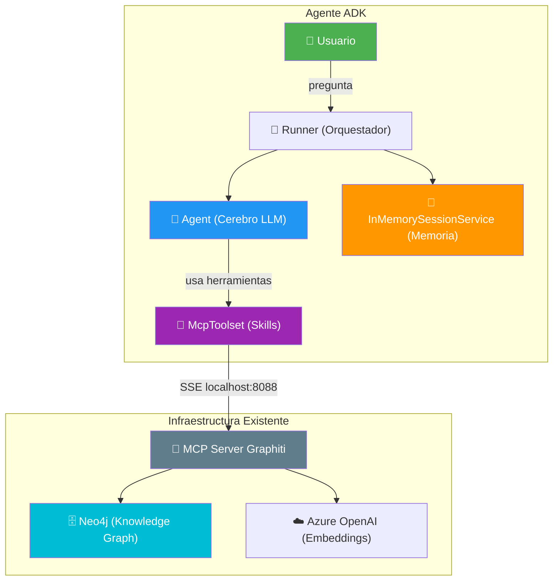
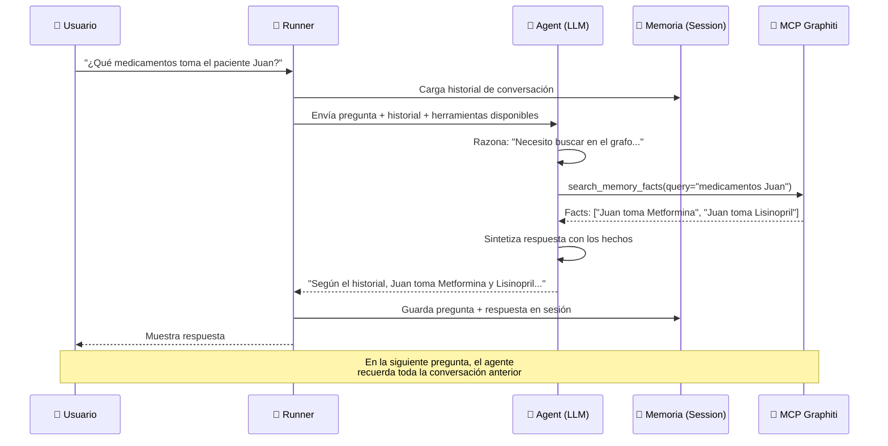

# Agente Médico con Google ADK + MCP Graphiti

Crear un agente de IA médico usando **Google Agent Development Kit (ADK)** que se conecta al servidor MCP de Graphiti existente para consultar el Knowledge Graph almacenado en Neo4j. El agente maneja memoria de conversación de forma nativa.

---

## Arquitectura del Agente



### Componentes Clave

| Componente | Rol | Tecnología |
|---|---|---|
| **Cerebro (LLM)** | Razona, decide qué herramientas usar, genera respuestas | Gemini / Azure OpenAI (configurable) |
| **Skills (Tools)** | Conecta al MCP de Graphiti para buscar/agregar memoria | `McpToolset` + SSE a `localhost:8088` |
| **Memoria** | Mantiene el historial de la conversación entre turnos | `InMemorySessionService` |
| **Orquestador** | Coordina el flujo entre usuario → LLM → herramientas → respuesta | `Runner` de ADK |

---

## User Review Required

> [!IMPORTANT]
> **Modelo LLM**: El agente necesita un modelo como cerebro. Las opciones son:
> 1. **Gemini** (nativo de Google ADK) — requiere `GOOGLE_API_KEY`
> 2. **Azure OpenAI** (el que ya usas para el MCP) — requiere configuración extra con LiteLLM
>
> **¿Cuál prefieres usar?** Recomiendo Gemini por ser nativo del framework, pero puedo configurar Azure OpenAI si lo prefieres.

> [!WARNING]
> **API Key necesaria**: Sea cual sea el modelo, necesitarás una API key configurada como variable de entorno. Para Gemini sería `GOOGLE_API_KEY`, obtenible gratis en [Google AI Studio](https://aistudio.google.com/).

---

## Propuesta de Cambios

### Estructura de archivos

```
c:\Development\medGraph-RAG\agente\
├── __init__.py          # Marca el paquete
├── agent.py             # Definición del agente ADK
├── config.py            # Configuración (modelo, MCP URL, etc.)
├── main.py              # Punto de entrada: CLI interactivo
├── requirements.txt     # Dependencias
└── README.md            # Documentación de uso
```

---

### Componente: Agente ADK

#### [NEW] [config.py](file:///c:/Development/medGraph-RAG/agente/config.py)
Archivo de configuración centralizada:
- URL del servidor MCP (`http://localhost:8088/sse`)
- Modelo LLM a usar (ej: `gemini-2.0-flash`)
- Nombre de la aplicación y metadatos
- System prompt médico del agente

#### [NEW] [agent.py](file:///c:/Development/medGraph-RAG/agente/agent.py)
Definición del agente usando Google ADK:
- Crea el `Agent` con instrucciones médicas especializadas
- Configura el `McpToolset` con `SseServerParams` apuntando al MCP de Graphiti
- Las herramientas del MCP (search_memory_facts, add_memory, search_nodes, etc.) se descubren automáticamente
- El agente decide **autónomamente** cuándo buscar en el grafo, cuándo agregar memoria, etc.

#### [NEW] [main.py](file:///c:/Development/medGraph-RAG/agente/main.py)
CLI interactivo con bucle de conversación:
- Inicializa `InMemorySessionService` para mantener memoria entre turnos
- Crea el `Runner` que conecta Agent + Session + Tools
- Bucle `while True` que:
  1. Lee input del usuario
  2. Lo pasa al Runner
  3. Imprime la respuesta del agente
  4. Mantiene el historial automáticamente en la sesión

#### [NEW] [requirements.txt](file:///c:/Development/medGraph-RAG/agente/requirements.txt)
```
google-adk
```

#### [NEW] [README.md](file:///c:/Development/medGraph-RAG/agente/README.md)
Documentación de cómo arrancar y usar el agente.

---

## Cómo Funciona — Flujo de una Consulta



### Diferencia vs. `test_medicina.py` actual

| Aspecto | `test_medicina.py` (actual) | Agente ADK (nuevo) |
|---|---|---|
| ¿Quién decide buscar en el grafo? | Siempre busca, hardcodeado | El LLM decide autónomamente |
| Memoria de conversación | No tiene | Automática (SessionService) |
| Herramientas disponibles | Solo `search_memory_facts` | Todas las 9 del MCP |
| Prompt system | Fijo en cada llamada | Configurable, persistente |
| Extensibilidad | Hay que modificar el script | Se agregan tools sin tocar el core |

---

## Open Questions

> [!IMPORTANT]
> 1. **¿Qué modelo LLM quieres como cerebro?**
>    - `gemini-2.0-flash` (gratis con API key de Google AI Studio, nativo del framework)
>    - `gpt-4o-mini` vía Azure OpenAI (el que ya usas, necesita configuración extra)
>    
> 2. **¿Prefieres modo CLI (terminal interactiva) o también quieres la interfaz web que trae ADK (`adk web`)?**

---

## Plan de Verificación

### Tests Automatizados
1. Instalar dependencias: `pip install google-adk`
2. Arrancar el MCP server de Graphiti (Terminal 1)
3. Ejecutar el agente (Terminal 2): `python agente/main.py`
4. Verificar que descubre las 9 herramientas del MCP
5. Hacer una pregunta médica y validar que el agente busca en el grafo

### Verificación Manual
- Enviar una pregunta médica y comprobar que el agente usa `search_memory_facts` automáticamente
- Enviar una pregunta de seguimiento para verificar que recuerda el contexto previo
- Agregar memoria médica y verificar que se persiste en Neo4j
